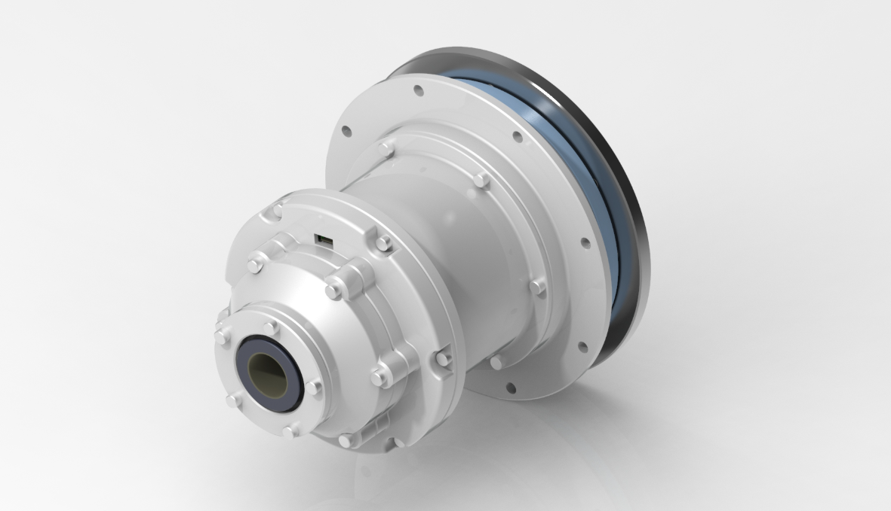
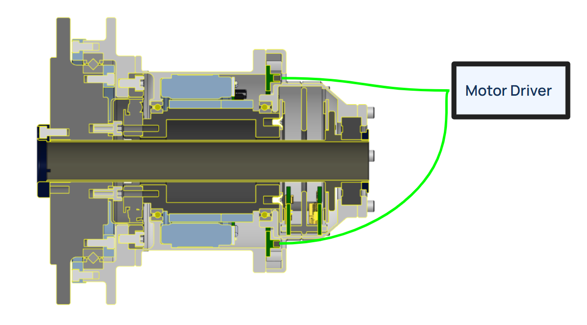

# Hollow Shaft Actuator — CAD Study

This project is a CAD and design exercise to develop my mechanical modeling skills and learn the internal architecture of a hollow shaft actuator. I reverse engineered it from a cross-section of a harmonic drive I was given for an interview. 

The PowerPoint `Harmonic Drive Actuator Project.pptx` dives into design, assembly, material information, and further elaborates on all design features.

*This project was done in March 2024.*

  
*Figure 1: Isometric View of the final product.*

---

## Assumptions / Requirements

- Minimize weight and footprint  
- Output shaft supports radial and axial loads  
- No active cooling or brake system  
- Controller and encoder output combined into a single PCB  
- Optimized for heavy loading, low speeds  
- Bearings preloaded with a slotted disk spring  
- Tolerance stack-up, vibration, deflection, and noise carefully considered

  
*Figure 2: Cross section view of the final product.*

---

## Parts Provided

- Servo Kit: [ILM70x18](https://www.tq-group.com/en/products/tq-robodrive/servo-kits/ilm70x18/)
- Harmonic Reduction Gear: [CSD20](https://www.hds.co.jp/english/products/detail.html?pdid=01hd13_csd-2a)
- Encoder: [AksIM-2 53mm](https://www.rls.si/eng/aksim-2-off-axis-rotary-absolute-encoder?___from_store=jp)

---

## Parts Sourced

I sourced these COTS parts to fill in the rest of the design based on my assumptions and requirements.

| Component | Part Number | Link | Purpose |
| --- | --- | --- | --- |
| Input Shaft Ball Bearings (x2) | KDN.SAA15CL0 | [SKF KDN.SAA15CL0](https://www.skf.com/group/products/thin-section-bearings/reali-slim-thin-section-bearings/productid-KDN.SAA15CL0) | Radial loads only |
| Output Shaft Bearings | CRBS708VUU | [IKO CRBS708VUU](https://www.ikont.com/download/crossed-roller-bearings/?wpdmdl=4042&refresh=5ffca031790ab1610391601) | Crossed roller, radial and axial loads |
| Hollow Shaft Bearing | 16003ZZCM | [16003ZZCM](https://bearingsdirect.com/16003zzcm-ball-bearing-17x35x8-shielded-16003-zzcm/) | Radial load, thin profile |

---

## Parts Modeled in Creo Parametric

The remaining parts, I modelled myself from a given cross section view. More information on each available in the powerpoint.
- Housing  
- Housing Upper 2  
- Housing Bottom  
- Bearing Caps (top and bottom)  
- Input Shaft (303 Stainless)  
- Hollow Shaft  
- Output Shaft (interfaces with harmonic gears)  
- Bearing Retainers for Output Shaft  
- Controller PCB outline
